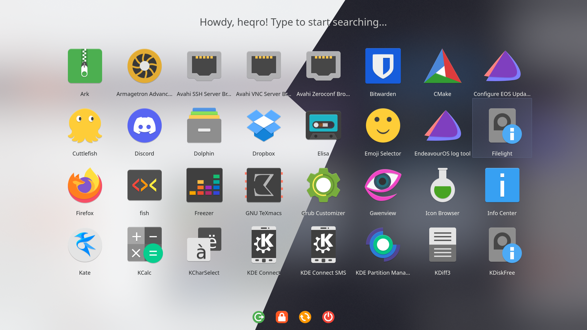

# Stupid Simple Launcher

Simple launcher for your applications as well as session management (logout, lock, shutdown, reboot), search and favorite applications support.
Find much more & discuss at the website [you can easily download it from](https://www.pling.com/p/1584342/).

## Installation

Extract the folder, and just

`kpackagetool5 -t Plasma/Applet --install stupidsimplelauncher`

to add it to your system.

