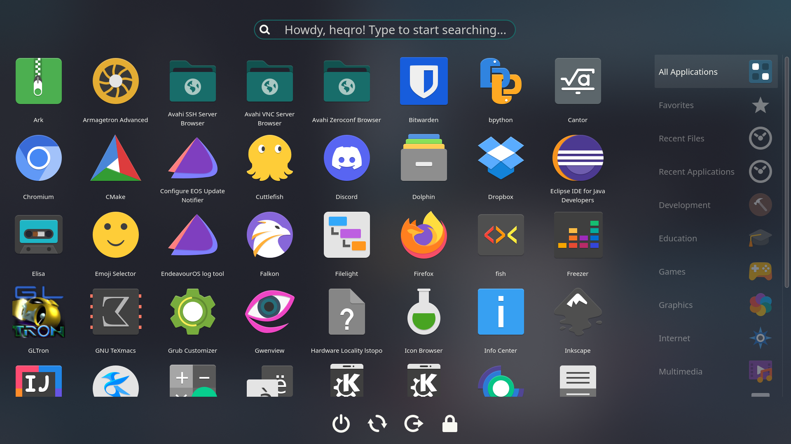

# Stupid Simple Launcher

Simple launcher for your applications as well as session management (logout, lock, shutdown, reboot), search and favorite applications support. Under heavy development.

Find much more & discuss at the website [you can easily download it from](https://store.kde.org/p/1584342).

## Installation

*Note*: you shouldn't really be using this install method, and should be using `ocs-url` instead.

Anyway, extract the folder, and just

`kpackagetool5 -t Plasma/Applet --install stupidsimplelauncher`

to add it to your system.

# Gallery

