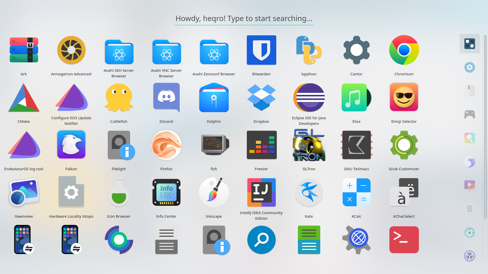
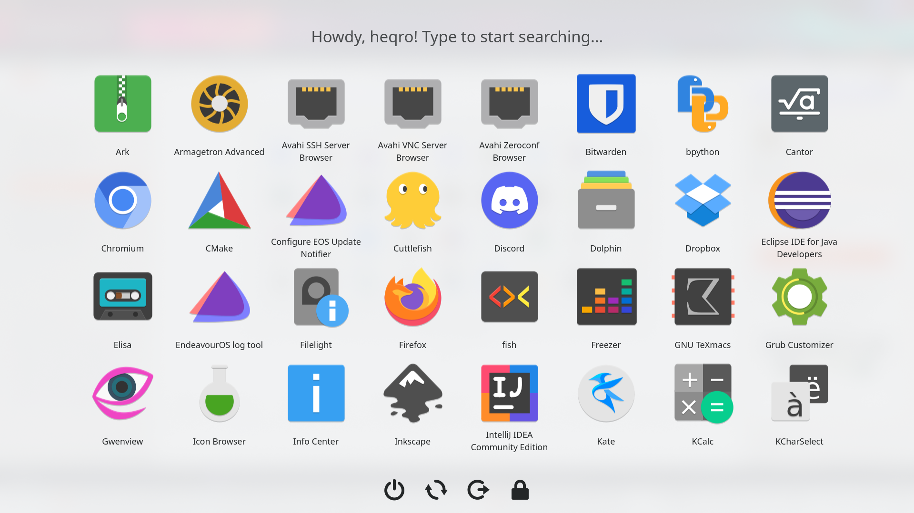

# Stupid Simple Launcher

- [Stupid Simple Launcher](#stupid-simple-launcher)
  * [Installation](#installation)
- [Features](#features)
  * [Applications grid](#applications-grid)
  * [Search bar](#search-bar)
  * [Categories sidebar](#categories-sidebar)
  * [Session control bar](#session-control-bar)
- [Gallery](#gallery)

Simple launcher for your applications as well as session management (logout, lock, shutdown, reboot), search and favorite applications support. Under heavy development.

Find much more & discuss at the website [you can easily download it from](https://store.kde.org/p/1584342).

## Installation

*Note*: you shouldn't really be using this install method, and should be using `ocs-url` instead.

Anyway, extract the folder, and just

`kpackagetool5 -t Plasma/Applet --install stupidsimplelauncher`

to add it to your system.

# Features

The menu is made up of four different modules: an applications grid, a search bar, a categories sidebar and a session control bar. Note these two last elements may be completely hidden if you wish to.

## Applications grid

* Fine tune your applications grid by hiding and unhiding them, as well as marking them as favorites and showing them in a separate grid!

## Search bar

* Get a hand on the looks of the menu by choosing a Gnome-like design, a minimalistic design or something in between.
* Responsive search engine by making use of what KDE has to offer.
* More search bar designs to come! Be sure to chime in at [this thread if you have any ideas to share with me](https://github.com/heqro/stupid-simple-launcher/issues/3)!

## Categories sidebar

* Get an edge on the looks of your menu by choosing the design (icons only, icons+text, text only) of it, as well as fully customizing its size without fear of things breaking up!
* Categories management: for those who want to have a separate category for their Favorites/Recent apps/Recent files.

## Session control bar

* Manage your current session: shutdown, restart, lock screen and logging out are possible as it is now.
* More options to come as they get proposed by *you* according to what you need!

# Gallery

